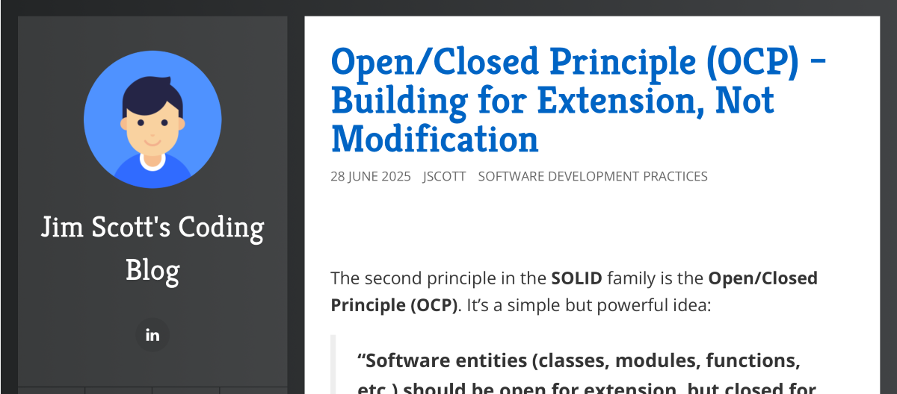
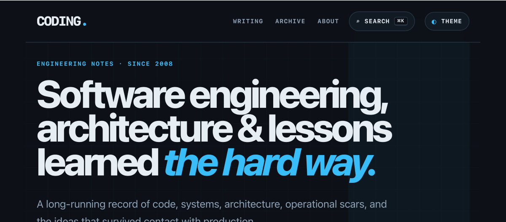

After running this blog on BlogEngine.NET for many years, I finally decided it was time to rebuild it.

The result is more than a visual redesign. Coding now runs on Jekyll and GitHub Pages, with Markdown files stored in Git as the source for the content.

Since the blog has been around since 2008, this became both a redesign and a migration of quite a bit of history.

## The Old Coding Blog

For years, the site ran on [BlogEngine.NET](https://github.com/BlogEngine/BlogEngine.NET). It gave me everything I needed from a traditional blogging platform: article publishing, categories, tags, archives, and the supporting application infrastructure.

Over time, the blog accumulated articles covering .NET, C#, SQL Server, Windows, architecture, design patterns, virtualization, GitHub, AI, and plenty of other topics.

*The previous version of the blog, captured from the Internet Archive.*

The old site continued to work, but both the presentation and the publishing model had started to feel dated. That made the redesign a good opportunity to rethink more than just the CSS.

## The New Coding

The new site is intentionally simpler.

*The redesigned Coding homepage at coding.infoconex.com.*

The homepage puts more emphasis on the writing and less on the surrounding interface. Navigation is simpler, the archive is easier to browse, tags are handled more consistently, search is built in, and the theme system can change the site's appearance without changing the content structure.

The design also better reflects how the subject matter has changed. The early articles were often focused on individual development problems, while newer writing includes architecture, engineering practices, automation, GitHub, and AI-assisted development.

The goal was to give both the old and new material a better home.

## More Than a Redesign

The biggest change is underneath the presentation.

The site moved from **BlogEngine.NET to GitHub Pages**, with **Jekyll** generating the site and **Markdown files in Git** serving as the source for each article.

The old site was a blogging application containing the content. The new site is a repository containing the content and everything required to build and publish it.

That makes the workflow much closer to how I already manage software. Articles, layouts, styles, scripts, and configuration are all version controlled. Changes can be reviewed with normal Git diffs, and the repository is the source of truth for the site.

Markdown is an important part of that model. The articles are plain-text files rather than content tied to a specific blogging platform, which makes them easier to move, search, update, and maintain over time.

## Migrating the History

Moving a blog with content dating back to 2008 required more than simply creating a new theme.

I wanted to preserve the existing articles, publication dates, and URLs where practical while also cleaning up metadata, normalizing tags, improving navigation, and reconnecting related content.

Some of the older articles cover technologies that are no longer current, but that is part of the value of keeping them. A technical blog that has existed this long becomes a record of how software development has changed.

The archive now spans older .NET, Windows, and SQL Server topics alongside newer articles about GitHub automation, modern architecture, and AI-assisted development.

## A Simpler Publishing Model

Most of the site is static content, so it does not need to operate like a continuously running application.

Jekyll generates the HTML ahead of time, and GitHub Pages serves it. That means fewer moving parts and less infrastructure to maintain.

More importantly, it keeps the focus on the content.

## What Hasn't Changed

The technology behind the site has changed considerably, but the reason for writing it has not.

Many of the articles here started with a problem that took longer to solve than expected. Writing the solution down gives me a reference for later and may help somebody else avoid solving the same problem from scratch.

That is still the purpose of Coding.

## Out With the Old, In With the New

BlogEngine.NET served this site well for many years. Moving away from it was not about replacing something that had failed. It was about choosing an architecture and workflow that better fit how I want to maintain the site going forward.

The new Coding is simpler both visually and technically:

- **Markdown** for the content
- **Git** for the history
- **Jekyll** for the build
- **GitHub Pages** for publishing

The design has changed, and the publishing architecture has changed, but the articles and their history remain.

Welcome to the new **Coding**.
