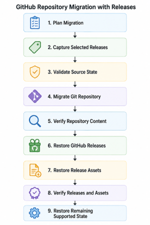

When I released the first version of [CopyGitHubRepo](/post/2026/08/22/copygithubrepo-v0-1-0-released-to-powershell-gallery), the goal was straightforward: make it easier to copy a GitHub repository without turning what should be a controlled operation into a collection of manual Git commands and GitHub API calls.

The initial release supported two different kinds of copies:

- **Snapshot**, which publishes the current approved contents of a repository with a clean history.
- **FullHistory**, which preserves branches, tags, commit history, Git LFS content, and supported repository configuration.

Today I released **CopyGitHubRepo v0.2.0**, and the biggest addition is focused squarely on the FullHistory scenario.

You can now optionally preserve **GitHub Releases and their assets** as part of a repository migration.

## Git History Is Not the Whole Repository

One of the things that becomes obvious when you start trying to move GitHub repositories is that Git and GitHub are not the same thing.

A mirror clone can preserve your Git objects. Branches and tags can come across with the repository history.

But a GitHub Release is additional GitHub metadata associated with a tag.

It can include things such as:

- release titles;
- release descriptions;
- draft or prerelease status;
- the release marked as Latest;
- attached binaries;
- ZIP files;
- installers;
- checksums;
- other release artifacts.

Those objects are not automatically recreated just because the corresponding Git tags exist in the destination repository.

For repositories that use GitHub Releases as part of their distribution process, that distinction matters.

## Introducing `-IncludeReleases`

Version 0.2.0 adds opt-in GitHub Release preservation to FullHistory migrations.

```powershell
Copy-GitHubRepository `
    -SourceRepository owner/source-repository `
    -DestinationRepository owner/destination-repository `
    -Mode FullHistory `
    -IncludeReleases
```

Release migration is intentionally opt-in rather than being an automatic side effect of FullHistory.

That is consistent with the overall design of CopyGitHubRepo: actions that expand the scope of a migration should be explicit and reviewable.

When enabled, CopyGitHubRepo can restore selected GitHub Releases after the repository's Git content has been migrated and verified.

## Releases Are Selected During Planning

I did not want release migration to work by determining one set of releases during planning and then running the selection logic again later when the migration executes.

That creates an opportunity for the source repository to change between those two operations.

Instead, v0.2.0 records the selected releases as part of the migration planning evidence.

The migration then restores the releases that were actually reviewed during planning.

This follows the same general model used elsewhere in CopyGitHubRepo:

> determine what is going to happen, capture the source state, review it, and then make sure the assumptions are still valid before changing the destination.

If a selected source release changes after planning, CopyGitHubRepo can detect that drift and fail closed rather than silently migrating something different from what was reviewed.

## Filtering Which Releases Are Migrated

Not every repository needs every historical release copied.

Version 0.2.0 therefore adds release-selection controls that can filter releases using:

- tag include patterns;
- tag exclude patterns;
- prerelease inclusion;
- draft inclusion;
- newest-N limiting.

That makes it possible to migrate the release history appropriate to the repository instead of treating release migration as an all-or-nothing operation.

For example, an organization may want to preserve production releases while excluding prerelease builds, or migrate only the most recent releases needed for currently supported versions.

The important part is that the resulting selection becomes part of the reviewed migration plan.

## Release Assets Are Preserved Too

Creating an empty GitHub Release with the same name is not enough.

If a release contains downloadable artifacts, those artifacts are part of the useful history of the project.

CopyGitHubRepo v0.2.0 therefore restores release assets along with the release metadata.

Where GitHub exposes the necessary information, verification includes characteristics such as:

- tag target;
- release metadata;
- asset name;
- asset label;
- asset size;
- content type;
- digest.

The selected source repository's **Latest** release designation is also preserved.

This means the release migration is not simply an API call to create similarly named releases. CopyGitHubRepo attempts to verify that the resulting GitHub Release structure matches the selected source state.

## Verification Remains a Separate Operation

One of the design choices I made in the original release was to provide an independent verification command rather than treating "the copy command finished" as proof that a migration succeeded.

That continues with release support.

`Test-GitHubRepositoryMigration` now supports `-IncludeReleases` and the same release-selection filters.

```powershell
Test-GitHubRepositoryMigration `
    -SourceRepository owner/source-repository `
    -DestinationRepository owner/destination-repository `
    -Mode FullHistory `
    -IncludeReleases
```

This allows the release portion of a FullHistory migration to be independently checked after the migration.

That distinction is important.

The tool performing a migration should verify its work, but operators should also have a way to run verification independently.

## Why Releases Are Restored After Repository Content

The order of operations also matters.

CopyGitHubRepo does not begin recreating releases before confirming that the underlying repository content has been successfully migrated.

The FullHistory workflow continues to emphasize verification before restoring additional GitHub state.



The sequence is deliberate.

If the underlying repository migration cannot be verified, CopyGitHubRepo should not continue layering additional GitHub state onto a destination that may already require investigation or recovery.

## Better Migration and Recovery Evidence

Version 0.2.0 also extends the migration and recovery information produced by CopyGitHubRepo with release provenance.

This becomes particularly useful when a migration partially succeeds.

Repository migration tools have to deal with an uncomfortable reality: once external systems have been changed, pretending that every error can be safely rolled back is dangerous.

CopyGitHubRepo favors preserving evidence about what happened so an operator can understand the resulting state.

Release migration follows that same philosophy.

## Checking the Installed Version

There is also a smaller convenience improvement in this release.

The wizard now supports:

```powershell
Start-CopyGitHubRepositoryWizard -Version
```

This reports the loaded CopyGitHubRepo module version without beginning repository discovery, planning, or migration activity.

It is a small feature, but useful when troubleshooting environments or confirming which release is loaded before performing a migration.

## More Than a Release Migration Feature

A fair amount of the work behind v0.2.0 is not directly visible from the command line.

The release adds controlled unit, integration, and GitHub end-to-end coverage around:

- filtered release selection;
- release assets;
- Latest release designation;
- tag-target preservation;
- independent post-migration verification.

I also continued tightening the safety behavior around repository protection restoration and GitHub API reads.

The basic rule remains the same: if CopyGitHubRepo cannot reliably establish the state it needs to safely continue, it should stop rather than guess.

## Documentation Improvements

The documentation received some work as part of this release as well.

Version 0.2.0 improves documentation discoverability and validation with:

- page-specific search metadata;
- social metadata;
- sitemap support;
- `robots.txt`;
- structured-data validation;
- clearer documentation quality-gate diagnostics.

Those aren't headline features, but they are part of turning CopyGitHubRepo from a useful script into a project that is easier to discover, understand, maintain, and release.

## Installing CopyGitHubRepo v0.2.0

CopyGitHubRepo is available from the PowerShell Gallery.

```powershell
Install-PSResource CopyGitHubRepo
```

Or with PowerShellGet:

```powershell
Install-Module CopyGitHubRepo
```

To install this specific release:

```powershell
Install-PSResource CopyGitHubRepo -Version 0.2.0
```

If you already have the module installed, you can verify the loaded version with:

```powershell
Start-CopyGitHubRepositoryWizard -Version
```

## Where CopyGitHubRepo Is Going

The original CopyGitHubRepo release established the core repository migration workflow.

Version 0.2.0 starts expanding that definition of a repository beyond Git objects alone.

For many projects, releases are part of the repository's history just as much as branches and tags are. They represent what was actually delivered to users at a point in time.

Preserving that information makes FullHistory migrations considerably more complete.

There are still additional areas of GitHub state that could eventually be considered when moving repositories, but I want to continue adding those capabilities carefully rather than turning repository migration into an opaque "copy everything" operation.

The goal remains the same:

**Know what is going to change, verify what can be verified, and leave enough evidence behind to understand exactly what happened.**

## Project Links

- **PowerShell Gallery:** [CopyGitHubRepo](https://www.powershellgallery.com/packages/CopyGitHubRepo/)
- **Project:** [infoconex/copy-github-repo](https://github.com/infoconex/copy-github-repo)
- **Documentation:** [CopyGitHubRepo Documentation](https://infoconex.github.io/copy-github-repo/)
- **Release v0.2.0:** [GitHub Release](https://github.com/infoconex/copy-github-repo/releases/tag/v0.2.0)
- **Changelog:** [CHANGELOG.md](https://github.com/infoconex/copy-github-repo/blob/main/CHANGELOG.md)

If you want the background on why CopyGitHubRepo uses Snapshot as its default, how Snapshot differs from FullHistory, or why planning and verification are central to the project, start with [Copy GitHub Repo – Clean Snapshots Without Carrying History](/post/2026/08/09/copy-github-repo-clean-snapshots-without-history).
