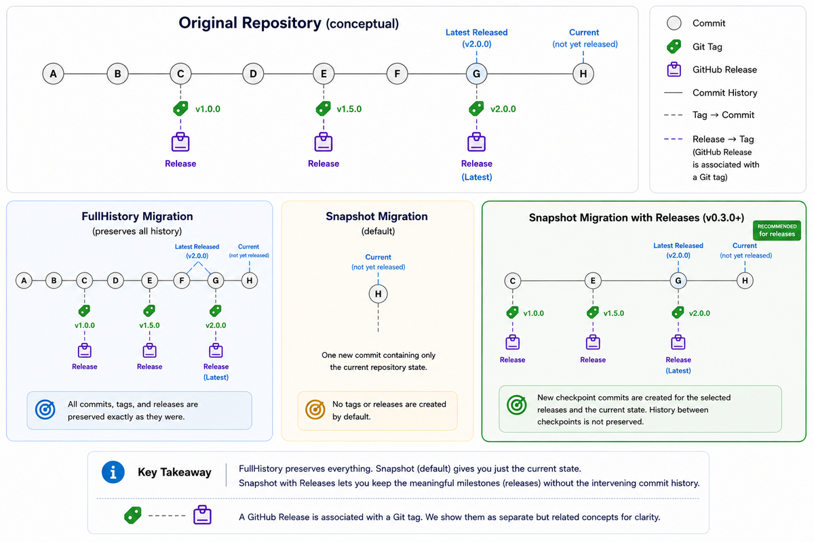

When I originally built [CopyGitHubRepo](https://github.com/infoconex/copy-github-repo), one of the primary use cases was pretty simple: take the current state of a GitHub repository and publish it somewhere else without dragging years of Git history along with it.

That became **Snapshot** mode.

Instead of cloning a repository's entire history, Snapshot creates a new repository containing the current state of the source with a clean, unrelated Git history.

There is an obvious tradeoff, though.

Sometimes the history you want to leave behind isn't the same thing as the history your users care about.

A project's GitHub Releases may represent important milestones such as `v1.0.0`, `v1.5.0`, or `v2.0.0`. Those releases may also contain release notes, downloadable assets, and useful points in the evolution of the project.

In [CopyGitHubRepo v0.2.0](/post/2026/08/30/copygithubrepo-v0-2-0-preserving-github-releases), I added GitHub Release preservation to **FullHistory** migrations.

Today I released **CopyGitHubRepo v0.3.0**, and it brings that capability to **Snapshot** migrations without turning Snapshot into FullHistory.

## Snapshot Can Now Preserve Releases

Version 0.3.0 adds `-IncludeReleases` support to Snapshot migrations.

```powershell
Copy-GitHubRepository `
    -SourceRepository infoconex/source `
    -DestinationRepository infoconex/destination `
    -ContentMode Snapshot `
    -IncludeReleases
```

The important part is what this command **doesn't** do.

It doesn't suddenly turn Snapshot into FullHistory.

The original Git commit SHAs aren't preserved. The original detailed commit ancestry isn't preserved. Hundreds or thousands of intermediate commits aren't copied into the destination.

Instead, CopyGitHubRepo constructs a **new checkpoint history** representing the releases you chose to preserve.

That distinction is important.

## Releases Become Checkpoints

A GitHub Release and a Git tag are related, but they are not the same thing.

A Git tag identifies a particular commit. A GitHub Release is GitHub metadata associated with that tag and can include release notes, assets, draft or prerelease status, and the designation of which release is Latest.

With Snapshot release preservation, CopyGitHubRepo recreates the selected release states as new checkpoint commits. The release tags are recreated against those new commits, and the corresponding GitHub Releases are recreated against the tags.

The original commit identities are intentionally not preserved.



The diagram shows the difference between the three approaches.

**FullHistory** preserves the original Git history and release tag targets.

**Snapshot** creates one unrelated commit containing the current repository state and, by default, does not recreate tags or GitHub Releases.

**Snapshot with Releases** creates a new, unrelated checkpoint history for the selected releases and then includes the current repository state when it differs from the latest selected release checkpoint.

You end up keeping the meaningful published milestones without carrying over all of the development history between them.

## I Think This Is a Better Definition of a Clean Copy

This feature came from thinking more carefully about what a clean repository actually means.

Initially, it was easy to define clean as:

> Only keep the files as they exist today.

That's still useful, and plain Snapshot mode continues to work that way.

But there is another useful definition:

> Keep the meaningful published states of the project, but discard the development history that produced them.

Those are very different kinds of history.

A repository might contain thousands of commits involving refactoring, experiments, dependency updates, reverted changes, branch merges, and other development activity.

That information can be valuable when maintaining the original project. It isn't necessarily valuable when publishing a clean copy of that project somewhere else.

A release such as `v2.0.0`, however, may be something you deliberately want to keep.

With v0.3.0 you can make that distinction.

## You Don't Have to Preserve Every Release

Release preservation is selectable.

Perhaps the repository has years of releases, but you only care about the three most recent releases from the v2 line.

You can do something like:

```powershell
Copy-GitHubRepository `
    -SourceRepository infoconex/source `
    -DestinationRepository infoconex/destination `
    -ContentMode Snapshot `
    -IncludeReleases `
    -ReleaseTag 'v2.*' `
    -ReleaseCount 3
```

Snapshot supports the same release-selection concepts available through the command interface, including tag inclusion and exclusion, prerelease and draft handling, and limiting the number of releases selected.

Those options have also been added to the guided wizard.

If you prefer working interactively, you can still start with:

```powershell
Start-CopyGitHubRepositoryWizard
```

and configure release preservation as part of the Snapshot workflow.

## Building New History Requires Being Careful

There is an interesting safety issue created by this feature.

CopyGitHubRepo isn't merely copying commits for this scenario. It has to determine the repository state represented by each selected release and then deliberately construct a new history from those states.

I don't want the tool guessing when that evidence doesn't make sense.

The v0.3.0 implementation therefore builds Snapshot checkpoints from reviewed tag, ref, and tree information and orders them according to their source ancestry.

If multiple selected releases represent the same source state, the planning process can coalesce that duplicate target rather than manufacturing unnecessary checkpoint commits.

More importantly, incompatible release topology or changes to the selected source state cause the migration to **fail closed** rather than allowing the tool to invent history that wasn't actually supported by the source evidence.

That's a principle I've tried to maintain throughout CopyGitHubRepo:

> A migration utility should be conservative about claiming that it successfully preserved something.

## Verification Matters Too

Creating the destination is only half the job.

CopyGitHubRepo also verifies the resulting Snapshot checkpoint history.

That includes checking things such as:

- checkpoint ordering;
- parent relationships;
- repository tree equivalence;
- recreated tag targets;
- GitHub Release metadata;
- release assets;
- Latest-release designation;
- the final current repository state.

The destination shouldn't simply look approximately correct.

The tool should be able to demonstrate that the states it claimed to preserve actually match the states that were reviewed during planning.

## Snapshot vs. FullHistory Is Now a More Interesting Choice

With this release, the distinction between the two modes becomes clearer.

### Snapshot

Use Snapshot when you want a **new Git history**.

Without `-IncludeReleases`, you get a single unrelated commit containing the current state.

With `-IncludeReleases`, you can retain selected release states as newly created checkpoint commits while still leaving the original commit identities and detailed ancestry behind.

### FullHistory

Use FullHistory when the original Git history itself matters.

That includes situations where you need things such as:

- original commit ancestry;
- original commit identities;
- branches;
- tags pointing at their original historical commits;
- blame and history information;
- signed historical commits;
- other historical Git evidence.

With `-IncludeReleases`, FullHistory can additionally recreate the selected GitHub Releases against those preserved historical tag targets.

The decision is no longer simply:

**History or no history?**

It can now be:

**What history is actually worth preserving?**

And I think that's a much more useful question.

## Updating to v0.3.0

CopyGitHubRepo is available from the [PowerShell Gallery](https://www.powershellgallery.com/packages/CopyGitHubRepo/).

If you already have it installed using PSResourceGet:

```powershell
Update-PSResource CopyGitHubRepo
```

Or install it with:

```powershell
Install-PSResource CopyGitHubRepo
```

You can confirm the loaded module version without starting the migration wizard:

```powershell
Start-CopyGitHubRepositoryWizard -Version
```

The [v0.3.0 release](https://github.com/infoconex/copy-github-repo/releases/tag/v0.3.0) and the complete [CopyGitHubRepo documentation](https://infoconex.github.io/copy-github-repo/) are available now.

For me, this release fills an important gap in the original Snapshot concept.

Sometimes you really do want to leave the past behind.

That doesn't mean you have to forget the milestones.
