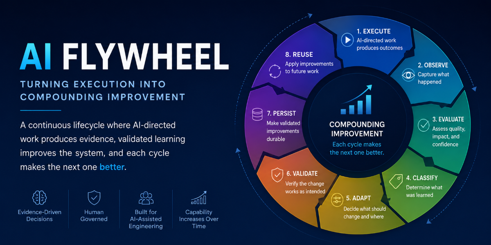

Since January, I have been working on an idea that started with a fairly simple question:

**What would it look like if AI-assisted engineering systems could systematically learn from execution, not just within a conversation, but by improving the persistent assets future work depends on?**

What started as an idea eventually became the [AI Flywheel Specification](https://infoconex.github.io/ai-flywheel-spec/).

But defining the idea turned out to be only the beginning.

As I worked through what it would take to actually use the model in software engineering, the project naturally separated into four pieces:

**Specification → Framework → Testing → CLI**

That separation was not something I designed from the beginning. Each project appeared because the previous one exposed a new engineering problem that needed its own boundary.

Looking back, that evolution may be as interesting as the individual projects themselves.

## It started with the specification

The original problem was not really about building another AI agent.

We already have increasingly capable models that can write code, call tools, plan work, retry failures, and reason through complex problems.

The problem I was interested in was what happens **after execution**.

Suppose an AI successfully solves a problem today. What changes so that tomorrow's execution is better?

A conversation might contain that learning. Memory might retain some information. An agent might even reflect on what happened.

But none of those automatically creates a durable improvement to the engineering system.

That led to the central idea behind the AI Flywheel:

**Execution should produce evidence, and that evidence should be capable of improving the system used by future execution.**

The resulting lifecycle became:

**Execute → Observe → Evaluate → Classify → Adapt → Validate → Persist → Reuse**

The important part is not simply that the cycle repeats. It is that validated learning can change the starting point of the next cycle.

> **A loop repeats. A flywheel compounds.**

I wrote about that idea in more detail in [AI Flywheel Spec – From Agent Loop to Compounding System](/post/2026/07/15/ai-flywheel-spec-from-agent-loop-to-compounding-system).

The complete specification and documentation live at [AI Flywheel Specification](https://infoconex.github.io/ai-flywheel-spec/).

## A specification wasn't enough

Once the terminology and lifecycle started becoming concrete, another problem appeared.

A specification can define how something *should* behave, but it does not give an AI operating inside a repository the structure needed to behave that way consistently.

Where does operating state live?

How does an AI know where to begin?

How are missions represented?

Where is evidence stored?

Which files are authoritative?

What gets persisted between executions?

Those questions should not be reinvented every time an AI begins work in a repository.

That led to the second project: the [AI Flywheel Framework](https://github.com/infoconex/ai-flywheel-framework).

The framework provides an installable `.flywheel` operating model inside a repository.

This separation became important.

The **specification defines what the AI Flywheel means**.

The **framework defines one canonical way to operate that model inside a software repository**.

Those are related responsibilities, but they are not the same responsibility. Keeping them separate also means the specification does not become accidentally tied to one implementation.

I wrote about that distinction in [AI Flywheel Framework – Turning the Spec into an Operating Model](/post/2026/07/26/ai-flywheel-framework-turning-the-spec-into-an-operating-model).

## Then I needed to prove it worked

Building the framework created the next question:

**How do I know the implementation actually follows the specification?**

That question sounds obvious, but AI-assisted systems make it surprisingly easy to fool yourself.

A prompt works once.

A model produces the expected result.

You change the framework.

You try it again.

It still looks reasonable.

That is not strong evidence.

If the AI Flywheel was going to emphasize evidence-driven improvement, the framework itself needed to be developed the same way.

That resulted in another repository: [AI Flywheel Framework Testing](https://github.com/infoconex/ai-flywheel-framework-testing).

The testing project deliberately lives outside the framework. It contains version-pinned prompts, fixtures, test harnesses, expected behavior, and durable evidence.

That separation lets a test result identify exactly what was evaluated:

- the framework revision;
- the testing revision;
- the fixture;
- the prompt or scenario;
- the expected behavior;
- the observed result.

This became one of the more important lessons from the project.

When AI can generate both implementation and tests, having them agree with each other is not necessarily independent evidence that either is correct.

The specification needs to remain the contract.

The framework implements that contract.

The testing project challenges the implementation against it.

I explored that in [Testing the AI Flywheel Framework with Durable Evidence](/post/2026/07/27/testing-the-ai-flywheel-framework-with-durable-evidence).

## Eventually, manual operation became the problem

At this point the system had a specification, a framework, and an independent way to test the framework.

But actually operating it still involved something I increasingly wanted to eliminate: asking an AI to reason through mechanical operations that already had known rules.

For example, an AI could edit YAML files manually to advance lifecycle state.

But once the lifecycle rules are understood, why should every execution require the model to reason through those mutations again?

That is unnecessary variability.

It is also exactly the kind of problem described by one of the ideas in the specification: the **Moving Determinism Boundary**.

When a problem is new or ambiguous, AI reasoning may be appropriate. As we understand the problem better, stable behavior should move into deterministic capability.

That led to the [AI Flywheel CLI](https://github.com/infoconex/ai-flywheel-cli-python).

The CLI provides deterministic operations for things such as:

- inspecting Flywheel state;
- validating repository structure;
- installing the framework;
- upgrading framework-owned assets;
- starting executions;
- advancing lifecycle stages;
- enforcing known structural rules.

The AI can still reason about *what should happen*. It does not need to reinvent *how a known operation works*.

That distinction is discussed in [AI Flywheel CLI for Python – Operating the Flywheel Safely](/post/2026/07/31/ai-flywheel-cli-python-operating-the-flywheel-safely).

## Four projects, four different questions

What I like about where the architecture ended up is that each project answers a different question.

### Specification

**What should the system do?**

The specification defines terminology, lifecycle semantics, governance, evidence requirements, adaptation rules, and conformance expectations.

[AI Flywheel Specification](https://infoconex.github.io/ai-flywheel-spec/)

### Framework

**How do we make that operating model concrete inside a repository?**

The framework provides the canonical files, structure, state, missions, goals, evidence locations, and operating boundaries.

[AI Flywheel Framework](https://github.com/infoconex/ai-flywheel-framework)

### Testing

**How do we know the implementation actually behaves according to the specification?**

The testing repository provides independent scenarios, fixtures, version-pinned inputs, and durable test evidence.

[AI Flywheel Framework Testing](https://github.com/infoconex/ai-flywheel-framework-testing)

### CLI

**How do we make known operations deterministic, repeatable, and practical?**

The CLI moves stable operational behavior out of repeated AI reasoning and into executable tooling.

[AI Flywheel CLI](https://github.com/infoconex/ai-flywheel-cli-python)

None of those projects should own all four responsibilities.

That separation has become part of the design.

## The architecture mirrors the idea

There is something slightly recursive about the way the project evolved.

The AI Flywheel argues that we should not continue asking AI to reason through a problem once we have enough evidence to represent that knowledge more reliably.

The project itself evolved the same way.

Initially, much of the idea existed as reasoning.

Then the reasoning became a specification.

The specification exposed repeatable operating structure, which became the framework.

Operating the framework exposed behaviors that needed repeatable validation, which became the testing project.

Using the framework exposed mechanical operations that no longer required AI reasoning, which became the CLI.

In other words, building the AI Flywheel started exercising the same principle the Flywheel describes:

**Move what we have learned into increasingly durable and reliable forms.**

That was not something I fully appreciated when I started.

## Why I didn't combine everything into one repository

There would certainly be less repository management if this were one large project.

But it would also make some important boundaries much easier to blur.

The specification could start reflecting whatever the current implementation happens to do.

Tests could evolve alongside implementation assumptions.

The CLI could accidentally become the definition of the framework.

Implementation-specific decisions could leak into what is supposed to remain an implementation-neutral methodology.

Separate projects introduce some overhead, but they also force those contracts to remain visible.

That matters more to me than minimizing the repository count.

## Where I think this is heading

I do not think the interesting future of AI-assisted software engineering is simply better code generation.

Code generation will continue getting faster.

The more difficult problem is building engineering systems capable of determining:

- whether generated work was actually successful;
- what evidence supports that conclusion;
- what was learned;
- whether the learning should change future behavior;
- where that learning belongs;
- whether a proposed change is authorized;
- how the change should be validated;
- and how that validated improvement becomes reusable.

That is the problem I am trying to explore with the AI Flywheel.

It started as an idea about persistent learning.

It became a specification.

The specification needed an implementation.

The implementation needed independent testing.

Operating the implementation needed deterministic tooling.

And the result is beginning to look less like an AI experiment and more like an engineering system.

There is still a lot to learn, and I expect the architecture to continue evolving.

But that is also the point of the Flywheel.
