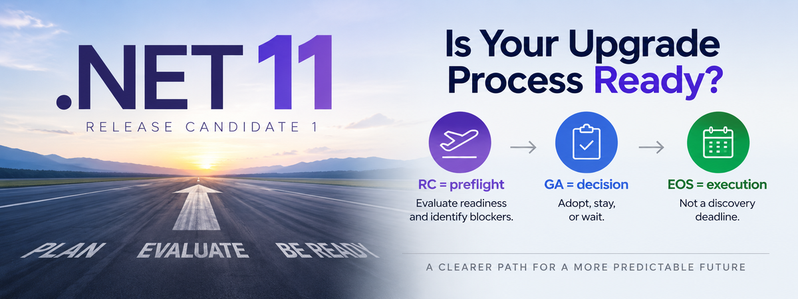

Microsoft released [.NET 11 Release Candidate 1](https://devblogs.microsoft.com/dotnet/dotnet-11-rc-1/) on September 8, 2026.

If you are responsible for .NET applications, that should trigger some activity in your organization.

Not necessarily an upgrade to .NET 11.

An evaluation.

At the same time, if you still have production applications running .NET 8 or .NET 9, you have a more immediate problem. According to Microsoft's [.NET support policy](https://dotnet.microsoft.com/en-us/platform/support/policy), both versions reach end of support on **November 10, 2026**. After that date, those releases will no longer receive patches, including security fixes, from Microsoft.

.NET 10 is the current LTS release and remains supported through **November 14, 2028**.

If you are on .NET 8 or .NET 9, you should already be moving toward .NET 10.

But once that work is finished, don't repeat the same cycle.

The bigger question is why an end-of-support deadline had to create the urgency in the first place.

## Use .NET 11 RC1 as a Preflight

.NET has a predictable release cadence. Microsoft releases a major version every November.

That predictability gives engineering organizations an opportunity to build a predictable process around it.

I think of the release candidate as the **preflight** and general availability as the **decision point**.

At RC, start answering questions:

- Can we build with the new SDK?
- Are our important dependencies ready?
- Do our build and deployment environments work?
- Are our hosting platforms ready?
- Are there breaking changes that affect us?
- What is preventing us from moving forward?

By GA, you should have enough information to make an informed decision.

Maybe you adopt .NET 11.

Maybe you stay on .NET 10.

Maybe a dependency, vendor, or platform prevents you from moving.

All three can be reasonable outcomes.

What should not happen is waiting until the current runtime approaches end of support before asking the questions.

## The Target Framework Usually Isn't the Hard Part

A .NET upgrade can look deceptively simple.

```xml
<TargetFramework>net8.0</TargetFramework>
```

becomes:

```xml
<TargetFramework>net10.0</TargetFramework>
```

Sometimes it really is close to that easy.

But an application is more than its target framework.

There are NuGet packages, database providers, authentication libraries, commercial SDKs, build agents, container images, monitoring tools, cloud services, deployment pipelines, and hosting environments.

The longer an application goes without being evaluated against newer versions of .NET, the more changes can accumulate around it.

Eventually a series of small compatibility checks becomes a migration project.

That is the pattern we should be trying to break.

## Continuous Evaluation Is Not Continuous Upgrading

I am not suggesting that every application move to every annual .NET release.

I am suggesting that organizations evaluate every **annual major release** as part of normal engineering work.

.NET 10 is an LTS release. .NET 11 is an STS release. Microsoft provides three years of support for LTS releases and two years for STS releases, while stating that the quality level is the same.

For many organizations, LTS should remain the default production baseline.

That is reasonable.

But being an LTS organization should not mean ignoring .NET between LTS releases.

If your plan is to stay on .NET 10 until .NET 12, evaluating .NET 11 can still tell you whether your common dependencies, build environment, hosting platforms, and representative applications continue to move forward cleanly.

You may conclude that staying on .NET 10 is exactly the right decision.

The point is not to force an upgrade.

The point is to make the decision intentional.

There is a big difference between:

> We evaluated .NET 11 and decided to remain on .NET 10.

and:

> We are on .NET 10 and nobody knows what would prevent us from moving.

The first is a decision.

The second is uncertainty.

## Make the Process Routine

A continuous evaluation process does not have to mean manually upgrading every application every year.

Much of the work can happen once across common platforms, dependencies, build environments, and application patterns.

For now, the operating model can stay simple:

**RC = preflight.**

Evaluate readiness and identify blockers.

**GA = decision.**

Adopt, stay, or wait on a known blocker.

**EOS = execution deadline.**

Not the point where you begin discovering what prevents you from upgrading.

That rhythm turns framework currency into normal engineering work instead of an occasional rescue project.

## What Should You Do Right Now?

If you have applications running .NET 8 or .NET 9, move toward .NET 10.

Both versions reach end of support on November 10, 2026.

But don't finish the .NET 10 migration and then forget about framework versions until 2028.

Use .NET 11 RC1 as the beginning of the next evaluation cycle.

You do not necessarily need to deploy .NET 11.

But you should understand whether you can, whether you should, and what is preventing you if you can't.

## EOS Should Be an Execution Deadline, Not a Discovery Deadline

If .NET 8 or .NET 9 reaching end of support caused your organization to start investigating .NET 10, solve that problem now.

Then fix the process that allowed it to become urgent.

Use .NET 11 RC1 as the beginning of the next cycle.

Framework currency should be something we continuously understand, not something we periodically rediscover.

Do that consistently and the next end-of-support announcement should not start a migration project.

It should simply confirm a transition you were already preparing for.
