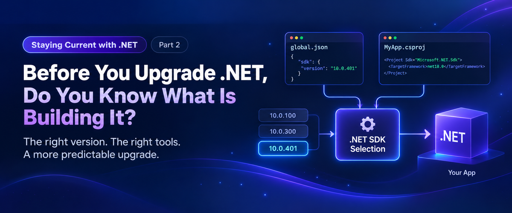

In the first article in this series, [.NET 11 RC1 Is Here. Is Your Upgrade Process Ready?](/post/2026/09/12/net-11-rc1-is-here-is-your-upgrade-process-ready), I argued that we should stop waiting for end-of-support deadlines before figuring out whether our applications can move forward.

The model was fairly simple:

**RC = preflight.**

**GA = decision point.**

**EOS = execution deadline.**

The goal is continuous evaluation rather than an upgrade project every few years.

But as I started thinking about how to actually build that process, I realized there is a step before upgrade readiness.

**Environment readiness.**

Before we can reliably evaluate the next version of .NET, we need to understand the environment that builds the version we are running today.

That led me to a surprisingly basic question.

**Do you know which .NET SDK is actually building your application?**

I thought I did.

## The Target Framework Does Not Answer That Question

Consider a typical project file:

```xml
<PropertyGroup>
  <TargetFramework>net10.0</TargetFramework>
</PropertyGroup>
```

It is easy to look at that and assume the project is being built with the .NET 10 SDK.

That is not necessarily true.

`TargetFramework` tells .NET which framework and API surface the application targets.

SDK selection is separate.

Microsoft documents this distinction in its [`global.json` overview](https://learn.microsoft.com/en-us/dotnet/core/tools/global-json). The SDK determines which version of the .NET CLI and associated build tooling is used, while the target framework determines what the application targets.

A newer SDK can intentionally build an application targeting an older version of .NET.

That is useful.

It also means the target framework alone does not fully describe your build environment.

## Start With Three Commands

First switch to the repository you want to evaluate, then run:

```powershell
cd path\to\your\repository
dotnet --version
dotnet --list-sdks
dotnet sdk check
```

Each answers a different question.

- `dotnet --version` tells you which SDK is selected for this repository.
- `dotnet --list-sdks` tells you which SDKs are installed on the machine.
- `dotnet sdk check` tells you whether the installed SDK feature bands are current.

I ran these on my own development machine.

`dotnet --version` returned:

```text
10.0.300
```

Then:

```powershell
dotnet --list-sdks
```

showed:

```text
8.0.425
9.0.121
10.0.112
10.0.300
```

So I had four SDKs installed and .NET had selected `10.0.300`.

That already told me more than saying:

> I have .NET 10 installed.

## Why Was 10.0.300 Selected?

When there is no applicable `global.json` controlling SDK selection, the .NET CLI normally selects the highest installed SDK according to its SDK resolution rules.

On my machine:

```text
8.0.425
9.0.121
10.0.112
10.0.300  <- selected
```

That selection is independent of whether the application I am about to build targets `net8.0`, `net9.0`, or `net10.0`.

The .NET 10 SDK can build applications targeting earlier versions.

Again, that is by design.

But it means two developers can clone the same repository and potentially build it with different SDKs simply because they have different SDKs installed.

For example:

```text
Developer A        Developer B        CI
SDK 10.0.1xx       SDK 10.0.3xx       SDK 10.0.4xx
     |                   |                  |
     +-------------------+------------------+
                         |
                      net10.0
```

Everyone is targeting .NET 10.

They are not necessarily using the same build toolchain.

## Why Does the SDK Matter?

The SDK is more than the version number displayed by `dotnet --version`.

It participates in the build through components and tooling such as MSBuild, Roslyn, NuGet, SDK targets, analyzers, source generators, and other build infrastructure.

Microsoft's [.NET SDK versioning guidance](https://learn.microsoft.com/en-us/dotnet/core/porting/versioning-sdk-msbuild-vs) explains the relationship between SDK feature bands, MSBuild, Visual Studio, and the rest of the toolchain.

Different SDKs are designed to remain highly compatible.

That does not mean they are identical.

The question I care about is less:

> Will this newer SDK probably build my application?

and more:

> Should my build toolchain change because somebody installed a new SDK, or because the repository intentionally changed it?

For a shared application, I prefer the second.

## Enter global.json

This is the problem `global.json` helps solve.

A repository can contain something like:

```json
{
  "sdk": {
    "version": "10.0.100",
    "rollForward": "latestFeature"
  }
}
```

Now SDK selection is no longer based only on whatever happens to be installed on the machine.

The repository has expressed an SDK policy.

The application can still target `net10.0`, but we have also placed boundaries around the SDK used to build it.

That was the distinction I had not given enough attention to.

## latestFeature Does Not Install Anything

There is an important detail here.

This:

```json
"rollForward": "latestFeature"
```

does not download or update the SDK.

It tells the SDK resolver which **already installed** SDKs are acceptable.

If the repository starts with:

```json
"version": "10.0.100"
```

and a later compatible .NET 10 feature band is installed, `latestFeature` allows the resolver to select it.

It does not silently install one.

That gives us flexibility without completely giving up control.

Microsoft's current [.NET upgrade guidance](https://learn.microsoft.com/en-us/dotnet/core/install/upgrade) uses this same general pattern: define an SDK version in `global.json` and use `latestFeature` so the repository can move through appropriate installed feature bands without unexpectedly jumping to another major SDK.

## Why Isn't global.json Already in Every Project?

Because creating a normal .NET application does not automatically create one.

For example:

```powershell
dotnet new console
```

and:

```powershell
dotnet new webapi
```

do not add a `global.json`.

It has its own template:

```powershell
dotnet new globaljson
```

You can also create it with an explicit SDK policy:

```powershell
dotnet new globaljson `
    --sdk-version 10.0.100 `
    --roll-forward latestFeature
```

So it is entirely possible to work with .NET for years without spending much time thinking about this file.

Microsoft does not say every application must have one either.

If always using the newest installed SDK is intentional, you may not need it.

For CI and other environments where build consistency matters, Microsoft's guidance becomes much more explicit about controlling the acceptable SDK range.

## SDK Feature Bands Add Another Layer

SDK versions such as these initially look a little strange:

```text
10.0.112
10.0.300
10.0.401
```

The hundreds digit identifies the SDK **feature band**.

Conceptually:

```text
10.0.1xx
10.0.2xx
10.0.3xx
10.0.4xx
```

The final two digits identify servicing releases within that feature band.

So `10.0.300`, `10.0.301`, `10.0.302`, and `10.0.303` all belong to the `3xx` feature band.

That matters when using:

```powershell
dotnet sdk check
```

On my machine, it reported:

```text
10.0.112    Up to date.
10.0.300    Patch 10.0.303 is available.
```

At first that looked odd.

How could one .NET 10 SDK be current while another .NET 10 SDK needed an update?

Because `dotnet sdk check` evaluates SDK feature bands independently.

`10.0.112` was current within its feature band.

`10.0.300` was not current within its feature band.

Neither statement necessarily means I have the newest overall .NET 10 SDK installed.

That is another reason saying:

> We use .NET 10.

does not tell us enough about the development environment.

## Control Does Not Mean Freeze

Once we decide that SDK selection should be controlled, it would be easy to go too far in the other direction.

For example:

```json
{
  "sdk": {
    "version": "10.0.100",
    "rollForward": "disable"
  }
}
```

There are scenarios where exact SDK pinning is useful.

But pinning an SDK and then ignoring it is not a good upgrade strategy either.

A controlled SDK still needs to be maintained.

Microsoft recommends keeping the SDK current so that you receive current tooling, fixes, and security updates.

That fits the philosophy of this series well.

The goal is not:

**Never change the SDK.**

The goal is:

**Make SDK changes intentional.**

## global.json Does Not Make the Environment Reproducible

Adding `global.json` does not suddenly give you a completely reproducible development environment.

It controls one important variable.

There are still plenty of others:

- .NET workloads
- NuGet package sources
- external tools
- environment variables
- operating system dependencies
- container images
- databases
- certificates
- Node.js or other build toolchains
- CI configuration

Controlling SDK selection removes one unknown from the build.

That is useful.

It is not the end of the problem.

## Audit Before You Change Anything

Before adding `global.json` everywhere, I would first understand what your repositories are doing today.

Start by switching to the repository you want to audit:

```powershell
cd path\to\your\repository
dotnet --version
dotnet --list-sdks
dotnet sdk check
```

Then look for `global.json`.

If one exists, read it.

If it does not, ask a few questions.

What SDK does another developer select when they enter the same repository?

What SDK does CI select?

What happens after someone installs the next major .NET SDK?

Would installing that SDK change the build toolchain without anybody changing source control?

And there is another question I discovered while working through this on my own machine:

**Who is responsible for keeping the SDK current?**

Visual Studio?

A standalone .NET installer?

A package manager?

The developer?

Those can all be different servicing paths.

A Windows machine can report that it is fully updated while the development SDKs installed on it tell a different story.

## Environment Readiness Comes Before Upgrade Readiness

This brings us back to the first article in this series.

If we want .NET 11 RC to become a normal preflight instead of the beginning of another migration project, we need a known starting point.

Before testing the next SDK, we should know:

- What SDK builds the application today?
- Is it current?
- Is that SDK selection intentional?
- Does CI make the same choice?
- Can another developer reproduce it?

Only then does continuous upgrade evaluation start to become predictable.

And the SDK is just the first layer.

The next question is broader:

**If I handed this repository to a clean machine, could it build the application?**

That is where environment readiness gets much more interesting.

## Microsoft Resources

Microsoft's [`global.json` overview](https://learn.microsoft.com/en-us/dotnet/core/tools/global-json) covers SDK selection, matching rules, and the available `rollForward` policies.

Microsoft's [Upgrade to a new .NET version](https://learn.microsoft.com/en-us/dotnet/core/install/upgrade) guidance includes its recommendation for controlling SDK selection with `global.json`.

For more detail about feature bands and how SDK versions relate to MSBuild and Visual Studio, see [.NET SDK, MSBuild, and Visual Studio versioning](https://learn.microsoft.com/en-us/dotnet/core/porting/versioning-sdk-msbuild-vs).

Microsoft also documents [`dotnet sdk check`](https://learn.microsoft.com/en-us/dotnet/core/tools/dotnet-sdk-check) and how its SDK update status is determined.
