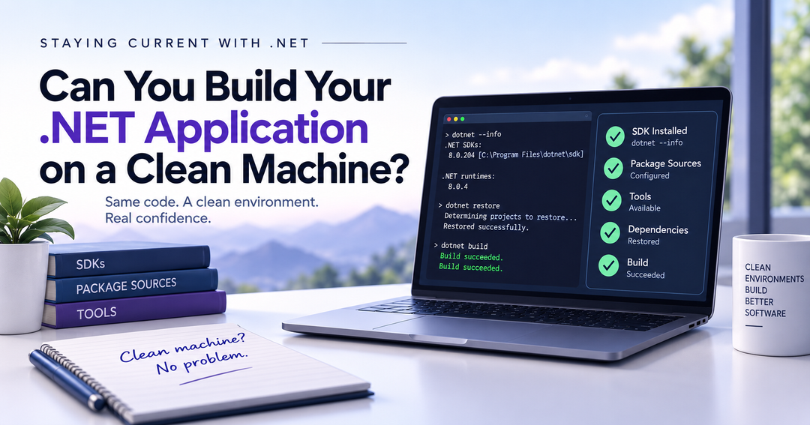

In the previous article in this series, [Before You Upgrade .NET, Do You Know What Is Building It?](/post/2026/09/16/before-you-upgrade-dotnet-do-you-know-what-is-building-it), I looked at SDK selection and [`global.json`](https://learn.microsoft.com/en-us/dotnet/core/tools/global-json).

The question was whether the repository controls which .NET SDK builds the application or whether that decision is being made by whatever happens to be installed on a developer's machine.

But `global.json` controls only one part of the environment.

That led me to a broader question:

**If I gave this repository to a developer with a clean machine, could they build, test, and run it without asking another developer what they are missing?**

That seems like a much better test of environment readiness.

## What Does a Clean Machine Mean?

I do not mean a completely empty machine.

Start with a known baseline: an operating system, Git, and whatever standard development platform your organization expects.

A fresh VM, sandbox, cloud runner, or disposable environment could work.

The mechanism matters less than knowing what is already there.

Then ask:

**Can the repository tell me what comes next?**

A dependency does not necessarily have to live in source control.

But it should not be a surprise.

## Developer Machines Accumulate State

Development machines tend to get better at building our applications over time.

That can hide problems.

My development machine has multiple .NET SDKs installed. It has development tools, package sources, Docker, Node.js, certificates, environment variables, and years of accumulated configuration.

Some of it I probably no longer remember installing.

Imagine a build process calls:

```powershell
dotnet ef
```

It works on every established developer's machine.

A new developer clones the repository and gets:

```text
Could not execute because the specified command or file was not found.
```

Nothing recently broke.

The application always depended on another tool.

The rest of the team just stopped noticing because they already had it.

At that point, the developers' machines have become part of the application's undocumented configuration.

## Start With the Machine That Works

Before moving to a clean environment, first look at a machine where the application already works.

For a .NET repository, I would start with:

```powershell
cd path\to\your\repository

dotnet --info
dotnet --list-sdks
dotnet --list-runtimes

dotnet tool list --global
dotnet tool list --local

dotnet nuget list source
```

The [`dotnet` command documentation](https://learn.microsoft.com/en-us/dotnet/core/tools/dotnet) covers the SDK and runtime inspection options.

The [`dotnet tool list`](https://learn.microsoft.com/en-us/dotnet/core/tools/dotnet-tool-list) command shows installed .NET tools, while [`dotnet nuget list source`](https://learn.microsoft.com/en-us/dotnet/core/tools/dotnet-nuget-list-source) shows configured package sources.

If the application uses Node, Docker, or other tooling, inventory those versions too.

This is not a prerequisite list.

It is an inventory of machine state that might be hiding prerequisites.

## Then Try the Repository Somewhere Clean

Start from the known baseline and clone the repository.

Then follow the normal development process for that repository.

For a simple .NET application, that might look like:

```powershell
git clone <repository>
cd <repository>

dotnet restore
dotnet build
dotnet test
dotnet run
```

For a larger repository, the real entry point might be a build script, solution file, orchestration project, or another command. For a library, `dotnet run` may not apply at all.

Use whatever a developer is actually expected to use.

The important part is what you **do not** do.

Do not install everything you think the application probably needs before starting.

Let it fail.

If restore cannot find a package source, record it.

If the build expects a command-line tool that does not exist, record it.

If the tests require a database nobody told you about, record it.

If someone says:

> Oh, you need this environment variable first.

record that too.

Those failures are not interruptions to the test.

They are the reason for running it.

**Every unexplained manual intervention counts against environment readiness.**

## Can the Repository Own the Fix?

Every time the clean environment exposes a missing requirement, ask:

**Can this become repository configuration instead of developer memory?**

Suppose the application requires a .NET command-line tool.

Instead of telling every developer to install it globally:

```powershell
dotnet tool install --global dotnet-ef
```

the repository can declare a local tool in:

```text
.config/dotnet-tools.json
```

and setup becomes:

```powershell
dotnet tool restore
```

Microsoft's [Tutorial: Install and use .NET local tools](https://learn.microsoft.com/en-us/dotnet/core/tools/local-tools-how-to-use) explains how local tool manifests work, and [`dotnet tool restore`](https://learn.microsoft.com/en-us/dotnet/core/tools/dotnet-tool-restore) restores the tools declared by the repository.

That is exactly the kind of dependency I want to move away from machine state.

## NuGet Can Hide State Too

Additional package sources can create the same problem.

Maybe the application uses an internal feed or a commercial component with its own feed.

If every established developer configured that source at the user level, this:

```powershell
dotnet restore
```

may work perfectly for them and fail for someone new.

A repository-level `NuGet.config` can make the expected sources explicit:

```xml
<packageSources>
  <clear />
  <add
    key="nuget.org"
    value="https://api.nuget.org/v3/index.json" />
</packageSources>
```

Microsoft's [`NuGet.config` File Reference](https://learn.microsoft.com/en-us/nuget/reference/nuget-config-file) explains configuration inheritance and how `<clear />` prevents previously defined sources from being inherited.

Private-feed credentials should remain external.

The important part is that the **source itself should not exist only in someone's machine configuration**.

If your repository also commits `packages.lock.json`, locked restores can provide another layer of predictability for package resolution.

## Building Is Not the Same as Running

Suppose this succeeds:

```powershell
dotnet restore
dotnet build
dotnet test
```

but the application cannot run because it expects SQL Server on `localhost`.

We proved that we can build it.

We did not prove that we can recreate the development environment.

Supporting services are legitimate dependencies. The question is how someone discovers them and how consistently they can be recreated.

For some applications, that may mean checking in:

```text
compose.yaml
```

and starting the required services with:

```powershell
docker compose up -d
```

That does not mean every dependency belongs in a container.

It means supporting infrastructure should be described as code when that is practical.

## Document What Remains External

Not everything belongs in configuration.

A developer may still need external software, network access, cloud permissions, credentials, certificates, or shared development infrastructure.

Those are legitimate prerequisites.

But someone cloning the repository should not have to discover them one failed command and one message to another developer at a time.

If that information does not already have an obvious home, create one.

For example:

```text
DEVELOPMENT.md
```

A developer should be able to determine:

```text
What software and versions do I need?
What services or access do I need?
What configuration or secrets must I provide?
How do I set up and verify the environment?
```

Documentation should not become a substitute for configuration or automation.

If `DEVELOPMENT.md` says:

```text
Install dotnet-ef globally.
```

ask whether the tool should be represented by a local tool manifest.

If it says:

```text
Add these NuGet feeds manually.
```

ask whether they belong in `NuGet.config`.

If it contains a long sequence of commands every developer must run the same way, ask whether those commands should become a bootstrap script.

A useful rule is:

**Encode what you can. Automate what you can. Document what remains.**

## Doesn't CI Already Prove This?

CI gets us close, but it answers a slightly different question.

If CI checks out the repository and successfully builds and tests it, we have strong evidence that the build can be reproduced in that environment.

But the environment itself may already include SDKs and other tools. The pipeline may also install dependencies, configure package sources, inject secrets, or start supporting services.

CI proves:

> We have an environment capable of building this application.

That is not automatically the same as:

> A developer can determine from this repository how to recreate the environment needed to work on this application.

The pipeline should be part of the investigation because it may already contain setup steps that developer documentation does not.

## Why This Matters to Staying Current with .NET

This series started with framework upgrades.

The first question was whether we continuously evaluate new .NET releases instead of waiting for end-of-support deadlines.

The second was whether we control which SDK builds the application today.

This is the next layer.

Before I can confidently test an application against a newer SDK, I want to know that I understand the environment that builds the current version.

Otherwise, when something fails during an upgrade, I have to answer two questions:

Did the new SDK expose a compatibility problem?

Or did the clean environment expose a dependency that had been hiding on our machines all along?

Those are very different problems.

A clean-machine test gives us a way to find the second kind before we blame the first.

`global.json` removes one source of uncertainty.

The rest of the environment deserves the same attention.

**Encode what you can. Automate what you can. Document what remains.**

Because **"it works on our machines" is still "it works on my machine."**

There are just more machines.

## Microsoft Resources

Microsoft's [`global.json` overview](https://learn.microsoft.com/en-us/dotnet/core/tools/global-json) explains how a repository can control which installed .NET SDK is selected.

Microsoft's [`dotnet` command](https://learn.microsoft.com/en-us/dotnet/core/tools/dotnet) documentation covers the CLI options used to inspect SDK and runtime information.

Microsoft's [`dotnet tool list`](https://learn.microsoft.com/en-us/dotnet/core/tools/dotnet-tool-list) documentation covers listing installed global and local .NET tools.

Microsoft's [Tutorial: Install and use .NET local tools](https://learn.microsoft.com/en-us/dotnet/core/tools/local-tools-how-to-use) explains local tool manifests and repository-local tools.

Microsoft's [`dotnet tool restore`](https://learn.microsoft.com/en-us/dotnet/core/tools/dotnet-tool-restore) documentation covers restoring the tools declared by the applicable manifest.

Microsoft's [`dotnet nuget list source`](https://learn.microsoft.com/en-us/dotnet/core/tools/dotnet-nuget-list-source) documentation covers listing configured NuGet package sources.

Microsoft's [`NuGet.config` File Reference](https://learn.microsoft.com/en-us/nuget/reference/nuget-config-file) covers NuGet configuration inheritance and repository-level configuration.

Microsoft's [PackageReference documentation](https://learn.microsoft.com/en-us/nuget/consume-packages/package-references-in-project-files#locking-dependencies) covers `packages.lock.json` and locked restores.

Microsoft's [`dotnet restore`](https://learn.microsoft.com/en-us/dotnet/core/tools/dotnet-restore), [`dotnet build`](https://learn.microsoft.com/en-us/dotnet/core/tools/dotnet-build), [`dotnet test`](https://learn.microsoft.com/en-us/dotnet/core/tools/dotnet-test), and [`dotnet run`](https://learn.microsoft.com/en-us/dotnet/core/tools/dotnet-run) documentation cover the core CLI commands used in the clean-environment example.
