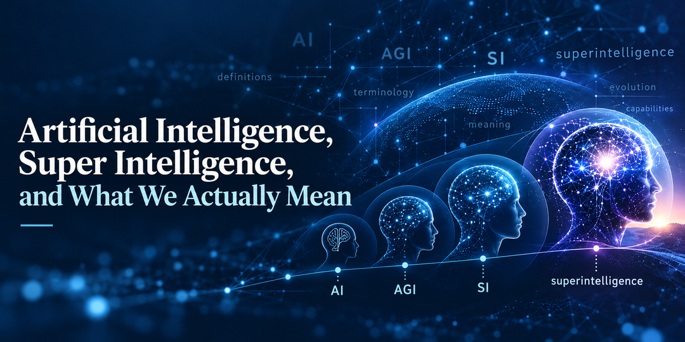

President Donald Trump said this week that Artificial Intelligence would be “hereinafter officially called ‘Super Intelligence.’”

The statement gave me a reason to go back and look at the terminology itself.

What exactly are we naming?

The more I looked at Artificial Intelligence (AI), Super Intelligence (SI), Artificial General Intelligence (AGI), and *superintelligence*, the less tidy the definitions became.

We use these terms regularly. That does not necessarily mean we are all using them the same way.

## Same Word Does Not Guarantee the Same Definition

Years ago, I ran training on unit testing using Vladimir Khorikov's [*Unit Testing: Principles, Practices, and Patterns*](https://www.manning.com/books/unit-testing).

One of the things I appreciated about the book was how seriously it took a seemingly simple question:

**What is a unit test?**

Khorikov spends time defining unit testing and exploring how different interpretations of isolation lead to different schools of thought. He also distinguishes unit tests from integration and end-to-end tests. Understanding those adjacent concepts helps establish the boundary around what we mean when we say “unit test.”

That experience stuck with me.

Two developers can repeatedly say “unit test” and still be talking about different things.

We have a similar issue here.

Trump used **Super Intelligence** as two words. In the sources I reviewed, *superintelligence* appears as one word and already has a history as a concept involving intelligence beyond human capability.

## Where Did These Terms Come From?

### Artificial Intelligence (AI)

The phrase appears prominently in the 1955 [proposal for the Dartmouth Summer Research Project on Artificial Intelligence](https://www-formal.stanford.edu/jmc/history/dartmouth/dartmouth.html) by John McCarthy, Marvin Minsky, Nathaniel Rochester, and Claude Shannon.

The proposal was built around the idea that aspects of learning and intelligence could be described precisely enough for machines to simulate them.

Years later, in a [Computer History Museum oral history](https://archive.computerhistory.org/resources/access/text/2012/10/102658149-05-01-acc.pdf), McCarthy recalled that when organizing the project he “had to call it something,” so he called it Artificial Intelligence. He also acknowledged that he vaguely thought he might have heard the phrase before but had never been able to trace it.

That is one reason I like going back to original sources. The history is often more nuanced than the version that gets repeated later.

### Artificial General Intelligence (AGI)

Mark Avrum Gubrud used the phrase “artificial general intelligence” in his 1997 paper [*Nanotechnology and International Security*](https://legacy.foresight.org/Conferences/MNT05/Papers/Gubrud/index.html).

His definition of advanced artificial general intelligence included systems that could rival or surpass the human brain in complexity and speed, reason with general knowledge, and be useful across activities where human intelligence would otherwise be required.

That is worth noticing. His definition did not put a hard boundary at exactly human-level capability.

Google DeepMind later examined existing definitions of AGI before proposing a framework of its own in [*Levels of AGI for Operationalizing Progress on the Path to AGI*](https://deepmind.google/research/publications/66938/). Their work is useful partly because they were trying to create a common language for discussing progress toward AGI rather than assuming everyone already shared one definition.

The White House's April 2026 [*Economic Report of the President*](https://www.whitehouse.gov/wp-content/uploads/2026/04/2026-Economic-Report-of-the-President.pdf) makes the disagreement even more explicit. It describes the exact definition of AGI as “hotly debated” and says the boundary between AGI and *superintelligence* is similarly contentious.

So AGI has a history, but not one uncontested definition.

### superintelligence

The idea of machine intelligence substantially exceeding human intelligence goes back even further.

In I. J. Good's [*Speculations Concerning the First Ultraintelligent Machine*](https://vtechworks.lib.vt.edu/items/5085379d-b24c-424e-8861-e70a47b4b2fb), he described an *ultraintelligent machine* as one capable of far surpassing human intellectual activity.

Good reasoned that designing machines is itself an intellectual activity. A machine capable of surpassing humans intellectually could therefore help design still better machines, resulting in what he called an “intelligence explosion.”

Decades later, Nick Bostrom wrote directly about *superintelligence* in [*How Long Before Superintelligence?*](https://nickbostrom.com/superintelligence). In his framing, human-level artificial intelligence and *superintelligence* were not the same thing. Superintelligence was something beyond human-level artificial intelligence.

That does not make Bostrom's definition universal.

It does show that the one-word term *superintelligence* already carries a history and meaning that predates the current discussion of Super Intelligence.

## The Definitions Still Do Not Line Up Cleanly

It is tempting to think of these terms as a simple progression from AI to AGI to *superintelligence*.

That can be useful shorthand, but the definitions do not line up that neatly.

The 2026 *Economic Report of the President* offers one useful distinction. A system can exceed human performance at a particular task while remaining specialized. Generality concerns the range of tasks a system can perform, while capability concerns how well it can perform them.

Those dimensions can overlap.

The report even notes that an AGI capable of performing all human intellectual tasks at computer speeds could itself be considered superintelligent under some interpretations.

Gubrud's much earlier definition complicates the boundary from another direction because his conception of AGI already allowed systems to rival or surpass human capability.

So the familiar AI-to-AGI-to-*superintelligence* progression should not be mistaken for a universally agreed taxonomy with precise boundaries.

Now add **Super Intelligence (SI)** to the vocabulary.

If SI is used as a broad label for everything we currently call AI, that is much broader than many existing uses of *superintelligence*.

If Super Intelligence instead means intelligence beyond human capability, then it describes something narrower than much of what we currently call AI.

Those are substantially different meanings for very similar terms.

That does not tell us which terminology is correct.

It shows why the definition matters.

## What I Took Away From the Exercise

The most interesting part of this exercise was not deciding whether AI should become SI.

It was realizing how much history and ambiguity already exists underneath terminology I use all the time.

AI, AGI, and *superintelligence* did not arrive as a perfectly organized taxonomy. Their meanings have developed through different authors, different contexts, and different attempts to describe changing technology.

Super Intelligence gives us another reason to examine that vocabulary rather than assume we already agree on what it means.

Technology will continue to change. The language around it will change too.

Going back to the sources occasionally and asking what we actually mean seems worthwhile.

Sometimes disagreement is about the answer.

Sometimes we are using the same words while starting with different definitions.

**A shared vocabulary is useful. A shared definition is more important.**

## References

- [The White House — “President Trump at the United Nations: While Others Have Talked, I Have Acted,” September 22, 2026](https://www.whitehouse.gov/releases/2026/09/president-trump-at-the-united-nations-while-others-have-talked-i-have-acted/)
- [John McCarthy, Marvin Minsky, Nathaniel Rochester, and Claude Shannon — “A Proposal for the Dartmouth Summer Research Project on Artificial Intelligence,” 1955](https://www-formal.stanford.edu/jmc/history/dartmouth/dartmouth.html)
- [Computer History Museum — *Oral History of John McCarthy*, 2007](https://archive.computerhistory.org/resources/access/text/2012/10/102658149-05-01-acc.pdf)
- [Mark Avrum Gubrud — “Nanotechnology and International Security,” 1997](https://legacy.foresight.org/Conferences/MNT05/Papers/Gubrud/index.html)
- [Google DeepMind — “Levels of AGI for Operationalizing Progress on the Path to AGI”](https://deepmind.google/research/publications/66938/)
- [Council of Economic Advisers — *2026 Economic Report of the President*](https://www.whitehouse.gov/wp-content/uploads/2026/04/2026-Economic-Report-of-the-President.pdf)
- [I. J. Good — “Speculations Concerning the First Ultraintelligent Machine”](https://vtechworks.lib.vt.edu/items/5085379d-b24c-424e-8861-e70a47b4b2fb)
- [Nick Bostrom — “How Long Before Superintelligence?”](https://nickbostrom.com/superintelligence)
- [Vladimir Khorikov — *Unit Testing: Principles, Practices, and Patterns*](https://www.manning.com/books/unit-testing)
